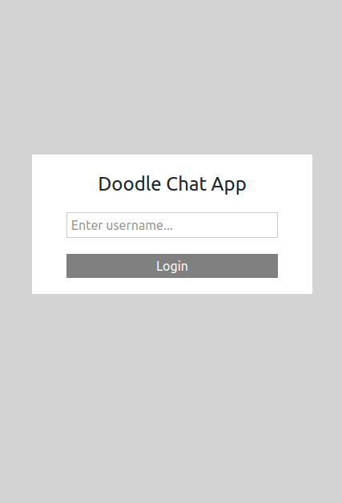
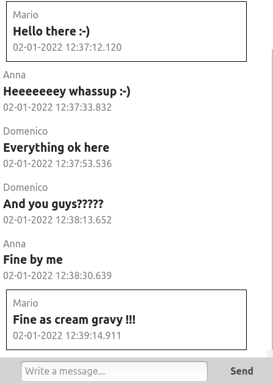

<h2> INFO & PURPOUSE </h2>

This is a sample fullstack project involving spring-boot and React technologies, it implements a messaging app in which a login page is presented to prompt the username and write messages

<h2> INSTRUCTIONS </h2>

The project is deployed through 3 containers:

- postgres-db (the chosen database)
- message-api (the spring backend, using the embedded tomcat server)
- webapp (with the React frontend, generated with create-react-app)

To build the required docker containers, use the following commands in the **message-backend** directory:

**docker-compose build**

Start docker API containers (must be in **message-backend** directory):

**docker-compose up**

The project will be accessible at **http://localhost:3000**
and the username provided at the fake login page will be displayed in the written messages.

To restart the app as another user it is sufficient to refresh the page
or simply open a new browser tab.

Stop the containers:

**docker-compose down**

Remove containers (in case a total reset is needed):

**docker-compose rm ${docker ps -a}**

